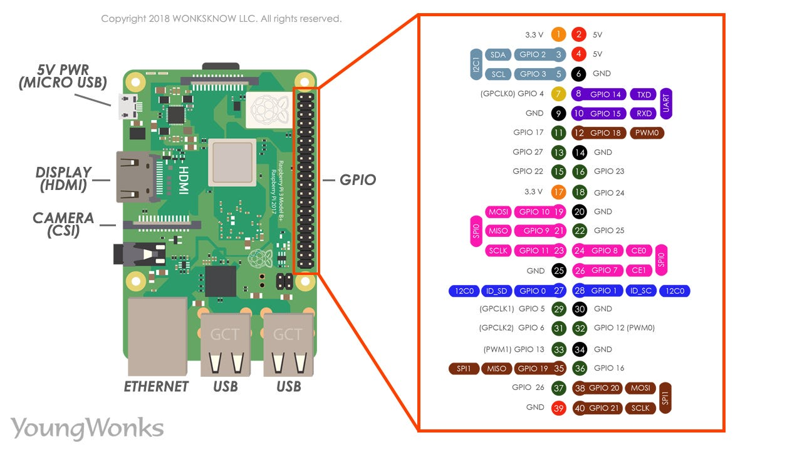

# fbg_opencv_example
  
This example shows:
- Read **cv::Mat** from **cv::VideoCapture**
- Convert to **fbg_img** struct
- Display on the TFT (Any TFT)

# Hardware for running the example
I am using a **gc9a01** display in Raspberry Pi 3B+, but other SPI (and I2C) screens can be used with this method.  
Wiring:  
| TFT Pin | Raspberry Pi Physical Pin (number inside circles on the pinout image) |
|----------------|---------------------------|
| VCC            | 1 (3.3v)                     |
| GND            | 6 (GND)                          |
| CS             | 24                        |
| RESET          | 13                        |
| DC / RS        | 22                        |
| MOSI           | 19                        |
| SCK/SCL           | 23                        |

Also, you will need a USB Camera.  
In my Raspberry is mounted on /dev/video0.  

Raspberry Pi 3B+ pin reference:  

# Configuration on Raspberry (or probably other linux systems)
*You have to change one thing in the SD card.*  

Open it with an external PC and navigate to **/boot** partition. 
> Note: On my PC is called **D:bootfs**.

You will find a folder called **/overlays** find here: **gc9a01.dtbo** 
> Note: Use your screen name *nameofscreen.dtbo*.
 
If exist, nice. If not, you have to find it in internet and add it.  
  
Now, you have to change in **config.txt** (this file is outside of **/overlays** folder):  

```dtoverlay=gc9a01```  
> Note: Use your screen name *dtoverlay=nameofscreen*
 
Insert the SD card and turn on the system. 
> Note: Probably you have now losed the HDMI Desktop image and you have a terminal. (Search in internet to fix that).

Ensure that now there are 2 devices (one is your HDMI and the other is the TFT display).
Type in terminal:  
```ls /dev/fb*```   
Should output at least /dev/fb0 and /dev/fb1

> Note: If not, check the wiring and SD /boot configuration. Screen is not being recognised.

# Downloading, compiling and running
I am using a workaround.  
Download where ever you want the repo of fbg: 

Inside of the folder examples you can find several examples

Run it first to check screen behaviour

If is working, insert in that folder my example code: cam_to_fbg.cpp

Install opencv and other dependencies if they are needed:

Compile it with:
